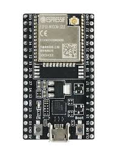

# ESP32 Solar Tank Temperature Reader

## Overview

This project utilizes an ESP32 SoC to monitor temperature via two DS18B20 sensors connected over I2C. The system is housed in a 3D-printed enclosure along with a 220V to 5V voltage regulator. It connects to Wi-Fi to send data to an MQTT server, which handles temperature readings from the solar water tank.

## Components Used

ESP32 SoC: Manages the sensors and Wi-Fi connection.

DS18B20 Temperature Sensors: Provide accurate water temperature readings.

3D-Printed Enclosure: Houses all electronic components.
Voltage Regulator (220V to 5V): Powers the system. It is recommended to install the regulator outside in a sheltered location.

Additional Supplies: Hot water pipes and cold welding techniques were used to install the sensors in the tank.

## Installation

## 1. Setting up the enclosure

The entire system is enclosed in a 3D-printed case designed to protect the electronics. Ensure the case is securely mounted and positioned away from direct exposure to the elements.

## 2. Wiring the Components

Connect the DS18B20 sensors to the ESP32 using I2C communication lines. Secure the wiring and ensure that it does not interfere with the tank's operation.

## 3. Voltage Regulator Setup

Install the voltage regulator within a protective casing outside the tank area to avoid moisture and temperature extremes.

## 4. Sensor Installation in the Tank

The sensors are installed inside the tank through holes sealed with cold welding to prevent leaks. Use hot water pipes to protect the sensor wiring from heat and corrosion.

## Configuration

Connect the ESP32 to your Wi-Fi network and configure the MQTT settings as per the details provided in the code. Adjust the IP address, MQTT server, and port number to match your network settings.
Usage

Once installed and configured, the ESP32 will automatically read temperatures and send the data to the configured MQTT server. You can monitor the temperatures through any MQTT client connected to the same server.

## Maintenance

Regular checks should be made to ensure the integrity of the enclosure and the functionality of the sensors and wiring. The voltage regulator should be checked periodically for heat damage or exposure.

## Future Improvements

    Integration with a broader home automation system.
    Enhancements in data encryption and security for IoT devices.
